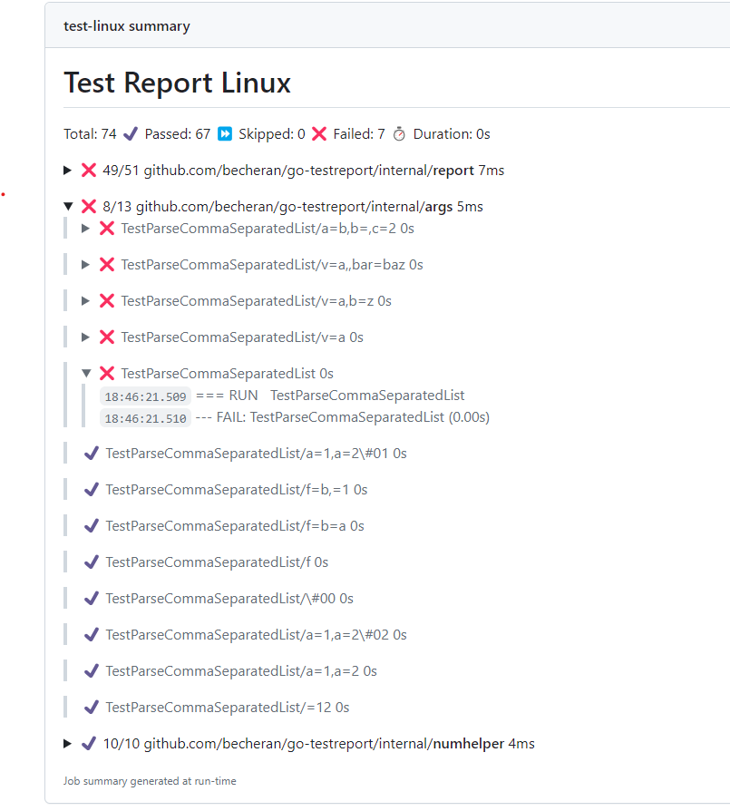

# Test Report

[](https://github.com/becheran/go-testreport/actions/workflows/go.yml)
[![Go Report Card][go-report-image]][go-report-url]
[![PRs Welcome][pr-welcome-image]][pr-welcome-url]
[![License][license-image]][license-url]

[license-url]: https://github.com/becheran/go-testreport/blob/main/LICENSE
[license-image]: https://img.shields.io/badge/License-MIT-brightgreen.svg
[go-report-image]: https://goreportcard.com/badge/github.com/becheran/go-testreport
[go-report-url]: https://goreportcard.com/report/github.com/becheran/go-testreport
[pr-welcome-image]: https://img.shields.io/badge/PRs-welcome-brightgreen.svg
[pr-welcome-url]: https://github.com/becheran/go-testreport/blob/main/CONTRIBUTING.md

Generate a markdown test report from the go json test result.

Matches perfectly with [github job summaries](https://github.blog/2022-05-09-supercharging-github-actions-with-job-summaries/) to visualize *go* test results:



The default output sorts the tests to show failing and slow tests at the top.

## Install

Install via the go install command:

``` cmd
go install github.com/becheran/go-testreport
```

Or use the pre-compiled binaries from [github releases](https://github.com/becheran/go-testreport/releases).

## Run

Will use the standard input and return the result into a file:

```bash
go test ./... -json | go-testreport $GITHUB_STEP_SUMMARY
```

Customize by providing a own template file. See also the [default markdown template](./internal/report/templates/md.tmpl). With the `vars` options custom values can be passed to the template from the outside:

```bash
go test ./... -json | go-testreport -template=./html.tmpl -vars="Title:Test Report Linux" $GITHUB_STEP_SUMMARY
```
